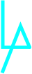

<h2 align="center"> 
  🌎Hello, World! I'm Leonardo Alencar🙋‍♂️
</h2>

🎓<strong>Front End</strong> student & future <strong>Full Stack</strong> developer🌐

 

<strong>Skills</strong>

 

____________

 

 
 

  <strong>get in touch!</strong>

  
  
  
  
  
  
  
Currently written a REACT README.md...

